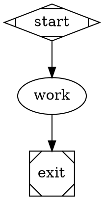

# Uncapped execution defaults

Pipeline walks and subgraph walks have no default total-step limit. The former
`node_count * 50` cutoff could terminate a progressing 11-node job at 550 steps.
This was a pipeline traversal budget, not an LLM-turn budget.

An operator can explicitly opt into a traversal budget:

Omitting `max_steps`, or setting it to `0`, means unlimited. Negative or
non-integer values are rejected. The same setting governs the main walk,
resumed walk, and subgraph walks. Explicit node timeouts, pipeline-duration
limits, cancellation and retries for failed goal gates still retain their
own semantics; this change does not turn a failed run into a success.

An unguarded cycle can now run indefinitely. Pipeline authors must supply a
real termination condition or arrange cancellation. This intentionally lets
progressing customer jobs use as many steps as the work requires.
